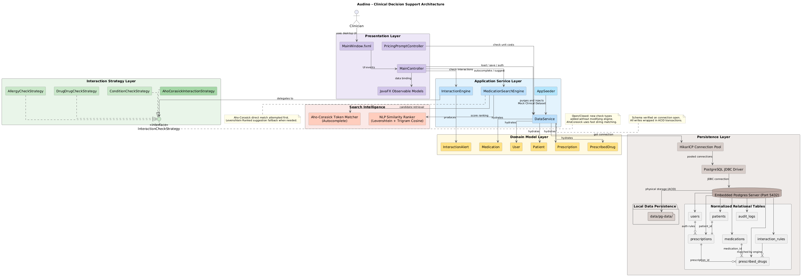
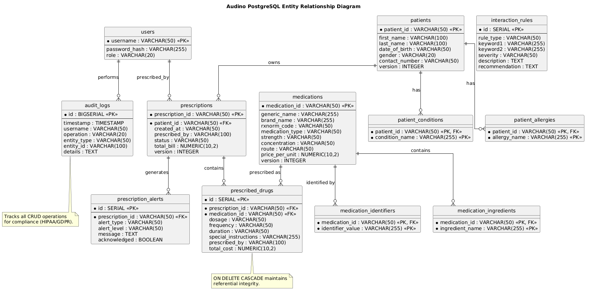
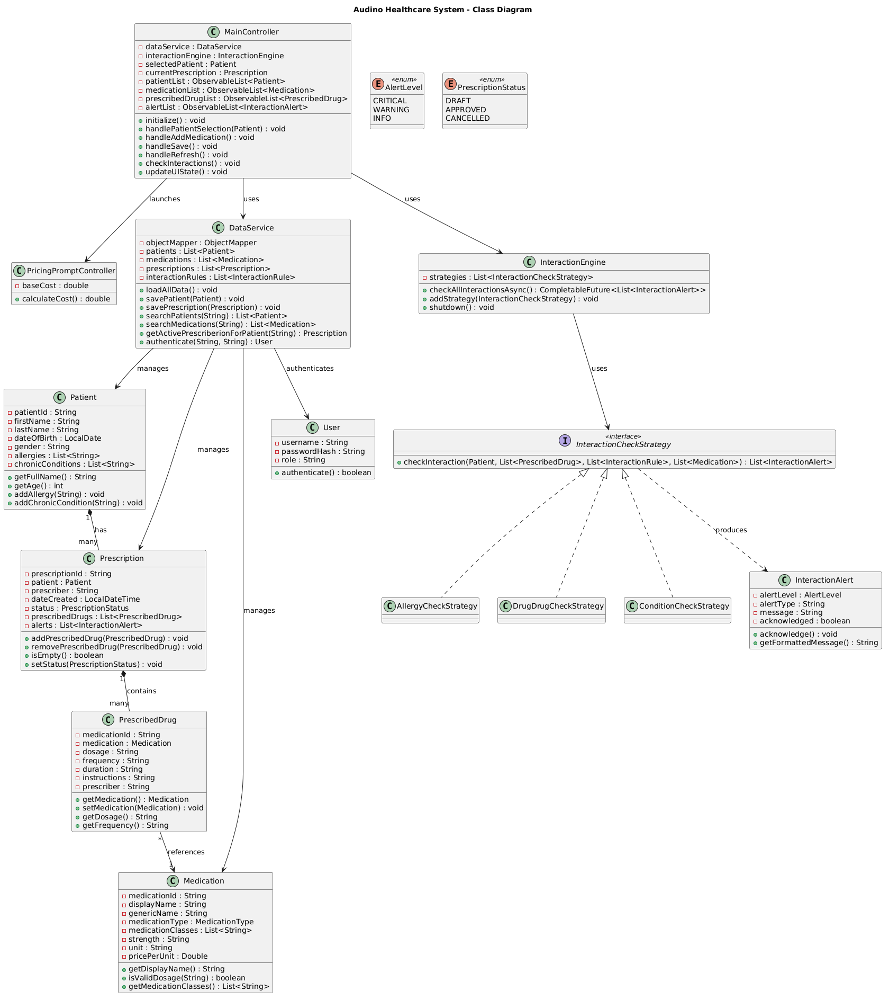
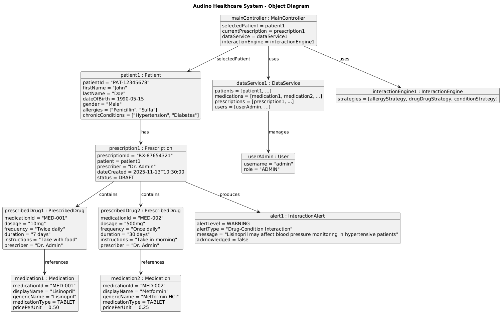
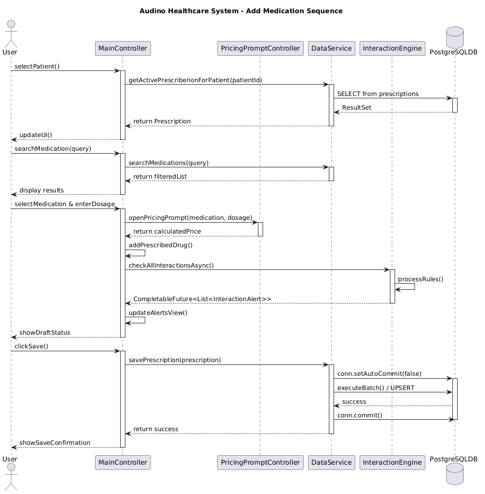
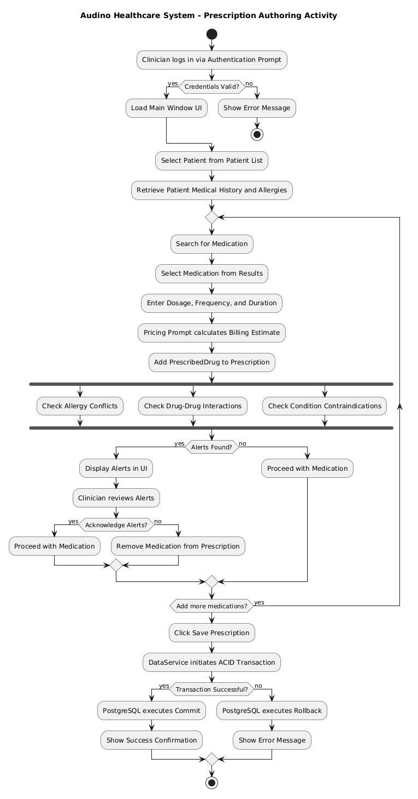

# Audino Database Documentation:

## Purpose:
This document defines the relational model used by the Audino main application. The persistence layer is implemented with PostgreSQL and JDBC. Clinical data is stored in normalized relational tables, while rule payloads and selective lists are stored as JSON text columns where a document shape is required.

## RDBMS Engine Profile:
PostgreSQL is used as the relational database. A native PostgreSQL server is expected on port 5432, but if unavailable, an embedded PostgreSQL instance will be provisioned automatically on the same port at runtime. ACID semantics are provided by PostgreSQL transactions, and referential integrity is enforced natively.

1. Engine name is PostgreSQL.
2. JDBC driver is org.postgresql.Driver.
3. Connection pooling is managed by HikariCP.
4. Default runtime URL format is jdbc:postgresql://localhost:5432/postgres.

## Database File and Runtime Resolution:
The main runtime connection is resolved as jdbc:postgresql://localhost:5432/postgres in standard execution. Configuration overrides can be provided through system properties or application.properties.

1. Property db.url is treated as the explicit JDBC connection string.
2. Property db.username and db.password define the authentication credentials.
3. Embedded Postgres fallback provides a robust zero-config startup sequence.

## Entity Relationship Design:
The relational model is centered on patient, prescription, and medication domains. Cardinality is intentionally constrained for safe prescription flow.

1. One patient is linked to one active prescription header through a unique key in prescriptions.patient_id.
2. One prescription header is linked to many prescribed drug rows.
3. Many prescribed drug rows are linked to one medication master row.
4. Interaction rules are stored in a singleton row with id = 1.

Detailed ER source is provided in documentation/ER_DIAGRAM.puml.

## Normalization and Data Shape:
The core relational schema is designed in accordance with Third Normal Form principles to eliminate data redundancy and ensure logical consistency. 

1. **First Normal Form (1NF)**: Each table row represents a unique record identified by a primary key (`patient_id`, `prescription_id`, `id`, `username`). Each column contains atomic values with respect to the relational engine, except for intentionally embedded document shapes.
2. **Second Normal Form (2NF)**: All non-key attributes are fully functionally dependent on the entire primary key. For example, in the `prescribed_drugs` associative table, properties like `dosage` and `frequency` depend entirely on the composite relationship between the prescription and the medication, represented by the surrogate `id` primary key.
3. **Third Normal Form (3NF)**: Transitive dependencies are removed. Patient demographic details (like `first_name`) live strictly in the `patients` table, while prescription attributes (`status`, `created_at`) live strictly in the `prescriptions` table. Changes to a patient's name do not require updates to their historical prescriptions.

Entity isolation guarantees logical separation.

1. Patient identifiers and demographic data are isolated in patients.
2. Prescription headers are isolated in prescriptions.
3. Prescription line items are isolated in prescribed_drugs.
4. Medication vocabulary and billing data is isolated in medications.
5. System users and hashed credentials are isolated in users.

### Strict Normalization:
Audino has fully deprecated JSON-based array storage to embrace strict relational normalization.

1. **Patient Data**: Arrays for `allergies` and `chronic_conditions` are broken out into dedicated associative tables (`patient_allergies`, `patient_conditions`).
2. **Medication Data**: Component lists like `active_ingredients` and `interaction_identifiers` reside in strict child tables (`medication_ingredients`, `medication_identifiers`).
3. **Alerts & Rules**: The interaction rules and prescription alerts have been completely normalized. `interaction_rules` is now a schema separating rule sets by `rule_type`, `keyword1`, `keyword2`, and `severity`. Alerts are mapped natively through `prescription_alerts`.

## Full Schema Definitions:
### users:
```sql
CREATE TABLE IF NOT EXISTS users (
    username VARCHAR(50) PRIMARY KEY,
    password_hash VARCHAR(255) NOT NULL,
    role VARCHAR(20) NOT NULL
);
```
### patients:
```sql
CREATE TABLE IF NOT EXISTS patients (
    patient_id VARCHAR(50) PRIMARY KEY,
    first_name VARCHAR(100),
    last_name VARCHAR(100),
    date_of_birth VARCHAR(50),
    gender VARCHAR(20),
    contact_number VARCHAR(50),
    version INTEGER DEFAULT 0
);

CREATE TABLE IF NOT EXISTS patient_allergies (
    patient_id VARCHAR(50) REFERENCES patients(patient_id) ON DELETE CASCADE,
    allergy_name VARCHAR(255),
    PRIMARY KEY (patient_id, allergy_name)
);

CREATE TABLE IF NOT EXISTS patient_conditions (
    patient_id VARCHAR(50) REFERENCES patients(patient_id) ON DELETE CASCADE,
    condition_name VARCHAR(255),
    PRIMARY KEY (patient_id, condition_name)
);
```

### medications:
```sql
CREATE TABLE IF NOT EXISTS medications (
    medication_id VARCHAR(50) PRIMARY KEY,
    generic_name VARCHAR(255),
    brand_name VARCHAR(255),
    rxnorm_code VARCHAR(50),
    medication_type VARCHAR(50),
    strength VARCHAR(50),
    concentration VARCHAR(50),
    route VARCHAR(50),
    price_per_unit NUMERIC(10,2),
    version INTEGER DEFAULT 0
);

CREATE TABLE IF NOT EXISTS medication_ingredients (
    medication_id VARCHAR(50) REFERENCES medications(medication_id) ON DELETE CASCADE,
    ingredient_name VARCHAR(255),
    PRIMARY KEY (medication_id, ingredient_name)
);

CREATE TABLE IF NOT EXISTS medication_identifiers (
    medication_id VARCHAR(50) REFERENCES medications(medication_id) ON DELETE CASCADE,
    identifier_value VARCHAR(255),
    PRIMARY KEY (medication_id, identifier_value)
);
```

### prescriptions:
```sql
CREATE TABLE IF NOT EXISTS prescriptions (
    prescription_id VARCHAR(50) PRIMARY KEY,
    patient_id VARCHAR(50) NOT NULL REFERENCES patients(patient_id) ON DELETE CASCADE,
    created_at VARCHAR(50),
    prescribed_by VARCHAR(100),
    status VARCHAR(50),
    total_bill NUMERIC(10,2),
    version INTEGER DEFAULT 0
);

CREATE TABLE IF NOT EXISTS prescription_alerts (
    id SERIAL PRIMARY KEY,
    prescription_id VARCHAR(50) REFERENCES prescriptions(prescription_id) ON DELETE CASCADE,
    alert_type VARCHAR(50),
    alert_level VARCHAR(50),
    message TEXT,
    acknowledged BOOLEAN
);
```

### prescribed_drugs:
```sql
CREATE TABLE IF NOT EXISTS prescribed_drugs (
    id SERIAL PRIMARY KEY,
    prescription_id VARCHAR(50) NOT NULL REFERENCES prescriptions(prescription_id) ON DELETE CASCADE,
    medication_id VARCHAR(50) NOT NULL REFERENCES medications(medication_id),
    dosage VARCHAR(50),
    frequency VARCHAR(50),
    duration VARCHAR(50),
    special_instructions VARCHAR(255),
    prescribed_by VARCHAR(100),
    total_cost NUMERIC(10,2)
);
```

### interaction_rules:
```sql
CREATE TABLE IF NOT EXISTS interaction_rules (
    id SERIAL PRIMARY KEY,
    rule_type VARCHAR(50),
    keyword1 VARCHAR(255),
    keyword2 VARCHAR(255),
    severity VARCHAR(50),
    description TEXT,
    recommendation TEXT
);
```

## Operational Index Plan:
The primary keys and unique keys already create essential indexes. Additional secondary indexes can be created for larger datasets.

1. Index on medications.rxnorm_code can be created for RxNorm query acceleration.
2. Index on medications.generic_name can be created for direct matching.
3. Index on prescribed_drugs.medication_id can be created for reverse medication drill down.
4. Index on prescriptions.created_at can be created for temporal reporting.

Example optional index statements are provided below.

```sql
CREATE INDEX IF NOT EXISTS idx_medications_rxnorm_code ON medications(rxnorm_code);
CREATE INDEX IF NOT EXISTS idx_medications_generic_name ON medications(generic_name);
CREATE INDEX IF NOT EXISTS idx_prescribed_drugs_medication_id ON prescribed_drugs(medication_id);
CREATE INDEX IF NOT EXISTS idx_prescriptions_created_at ON prescriptions(created_at);
```

## Transaction and Consistency Rules:
Write operations are strictly wrapped in JDBC transactions for guaranteed atomic behavior to satisfy full ACID requirements. 

1. **Atomicity**: When full replacement save is requested, parent and child rows are rewritten in controlled sequence. If any step fails, all operations roll back entirely.
2. **Consistency**: `users` constraints (unique usernames) and foreign keys are explicitly defined, preventing invalid or orphan state.
3. **Isolation**: Read-Committed isolation level ensures write skew and dirty reads are prevented when editing core schemas.
4. **Durability**: Successful `executeBatch()` calls followed by `conn.commit()` synchronously flush data to the PostgreSQL WAL log.

During bulk updates:
1. prescribed_drugs is cleared first in replacement flow.
2. prescriptions is cleared second in replacement flow.
3. patients is cleared last in replacement pre stage.
4. Insert batches are executed for patients, prescriptions, and prescribed_drugs.
5. Commit is issued after all batches are successful.

If a failure is raised before commit, active rollback semantics are triggered via `conn.rollback()` before returning control to the service layer.

## Authentication and Billing Integration:
The application leverages PostgreSQL constraints for high-fidelity extensions.

1. **Authentication**: Handled via the `users` table. The `password_hash` column stores BCrypt salted hashes exclusively. The `role` column regulates user permissions.
2. **Billing**: `medications.price_per_unit` introduces basic billing metrics allowing prescription costing calculations natively through numeric queries.

## Application Layer Mapping:
The relational schema is mapped to domain classes through DataService hydration logic.

1. patients rows are mapped to Patient.
2. medications rows are mapped to Medication subclasses by medication_type.
3. prescriptions rows are mapped to Prescription.
4. prescribed_drugs rows are mapped to PrescribedDrug and linked to Medication.
5. interaction_rules row is mapped to a rules map.

## Query and Search Behavior:
Medication search is performed in two phases.

1. Direct SQL loaded in memory collections are checked through substring matching for generic, brand, and RxNorm code.
2. If direct matches are not found, MedicationSearchEngine is used for ranked suggestion generation.

The ranked suggestion flow uses Aho Corasick token retrieval and NLP based similarity ranking.

1. Levenshtein similarity is used for edit tolerance.
2. Character trigram cosine similarity is used for lexical closeness.
3. Token overlap scoring is used for final rank shaping.

## Integrity Constraints:
Relational integrity is guarded through key constraints and cascading actions.

1. patients.patient_id is the primary key.
2. prescriptions.prescription_id is the primary key.
3. prescriptions.patient_id is unique and not null.
4. prescribed_drugs.prescription_id references prescriptions.prescription_id with ON DELETE CASCADE.
5. prescribed_drugs.medication_id references medications.medication_id.

## Backup and Restore Guidance:
PostgreSQL database backups can be made using standard pg_dump operations.

1. Run pg_dump to export the postgres database instance.
2. For embedded PostgreSQL instances, data resets upon termination.
3. A standalone PostgreSQL server should be used for production persistence.

## Validation Commands:
```bash
psql -h localhost -p 5432 -U postgres -d postgres -c "\dt"
psql -h localhost -p 5432 -U postgres -d postgres -c "SELECT COUNT(*) FROM medications;"
psql -h localhost -p 5432 -U postgres -d postgres -c "SELECT medication_id, generic_name, rxnorm_code FROM medications ORDER BY medication_id LIMIT 10;"
```

## Diagram References:
### System Architecture Diagram:


### Entity Relationship Diagram:


### Class Diagram:


### Object Diagram:


### Sequence Diagram:


### Activity Diagram:


