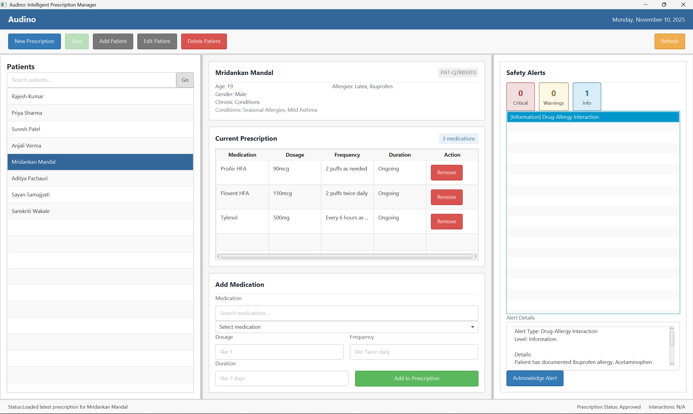

# Audino - Installation and Setup:

## System Requirements:

### Minimum Requirements:
- **Operating System**: Windows 10/11, macOS 10.14+, or Linux (Ubuntu 18.04+).
- **Java Development Kit**: JDK 11 or higher.
- **Maven**: Apache Maven 3.6.0 or higher.
- **Memory**: 4 GB RAM minimum.
- **Disk Space**: 500 MB free space.
- **Display**: 1280x720 resolution minimum.

### Recommended Requirements:
- **Java**: JDK 17 or higher.
- **Memory**: 8 GB RAM.
- **Disk Space**: 1 GB free space.
- **Display**: 1920x1080 resolution.

## Prerequisites Installation:

### Installing Java JDK:

#### Windows:
1. Download JDK from Oracle or Adoptium website.
2. Run the installer executable.
3. Follow installation wizard prompts.
4. Set `JAVA_HOME` environment variable to JDK installation path.
5. Add `%JAVA_HOME%\bin` to system PATH.

#### macOS:
```bash
brew install openjdk@17
```

#### Linux:
```bash
sudo apt update
sudo apt install openjdk-17-jdk
```

### Installing Maven:

#### Windows:
1. Download Maven binary zip from Apache Maven website.
2. Extract to `C:\Program Files\Apache\maven`.
3. Set `MAVEN_HOME` environment variable.
4. Add `%MAVEN_HOME%\bin` to system PATH.

#### macOS:
```bash
brew install maven
```

#### Linux:
```bash
sudo apt install maven
```

### Verifying Installation:

Check Java installation:
```powershell
java -version
```

Check Maven installation:
```powershell
mvn -version
```

Both commands should display version information without errors.

## Project Setup:

### Step 1: Clone or Download Project:

If using Git:
```powershell
git clone <repository-url>
cd audino
```

If downloaded as ZIP:
1. Extract ZIP file to desired location.
2. Navigate to `audino` directory.

### Step 2: Run Setup Script:

#### Windows:
```powershell
.\setup.ps1
```

#### macOS/Linux:
```bash
chmod +x setup.sh
./setup.sh
```

The setup script will:
- Verify Java and Maven installation.
- Download all required dependencies.
- Compile the project.
- Run initial tests.
- Initialize data files.

### Step 3: Configure Application:

#### Data Files Setup:

The following JSON files need to be properly configured in `src/main/resources/data/`:

1. **medications.json**:
   - Contains medication database.
   - Include drug name, active ingredients, and form type.

2. **interaction-rules.json**:
   - Defines interaction checking rules.
   - Specifies drug combinations to flag.

3. **patients.json**:
   - Sample patient data for testing.
   - Can be customized for demonstration purposes.

#### Configuration File:

Application settings can be customized through `ConfigurationManager` class:
- Database connection settings (if applicable).
- UI theme preferences.
- Logging levels.
- Alert sensitivity thresholds.

## Building the Application:

### Manual Build:

#### Compile Source Code:
```powershell
mvn clean compile
```

#### Package Application:
```powershell
mvn clean package
```

This creates an executable JAR file in the `target/` directory.

#### Run Tests:
```powershell
mvn test
```

### Build Profiles:

#### Development Build:
```powershell
mvn clean package -Pdev
```

#### Production Build:
```powershell
mvn clean package -Pprod
```

## Running the Application:

### Using Launcher (Easiest Method):

#### Windows Batch File:
Double-click `Audino.bat` or run from command prompt:
```batch
Audino.bat
```

This launcher automatically compiles the application if needed and runs it with proper JavaFX configuration.

### Using Start Script:

#### Windows:
```powershell
.\start.ps1
```

#### macOS/Linux:
```bash
./start.sh
```

### Manual Launch:

#### Using Maven:
```powershell
mvn javafx:run
```

#### Using JAR File:
```powershell
java -jar target/audino-1.0.jar
```

## Application Interface:

Once successfully launched, you will see the main application window:


**Description**: Main application window after successful launch showing patient management, prescription creation, and alert monitoring panels.

## Database Initialization:

### Initial Data Setup:

The application uses JSON files for data persistence. The system comes pre-configured with demonstration data:

1. Navigate to `src/main/resources/data/`.
2. Review and customize JSON templates.
3. Ensure proper JSON syntax.
4. Restart application to load new data.

### Pre-Loaded Demonstration Data:

The application includes ready-to-use sample data:

#### Medications Database:
- **150 Medications** including:
  - Common medications: Lisinopril, Warfarin, Ibuprofen.
  - Generic medications covering various drug classes.
  - Multiple medication types: Tablets, Liquids, Injections.

#### Patient Records:
- **8 Sample Patients** with realistic medical profiles:
  - **Mridankan Mandal**: Seasonal allergies, mild asthma.
  - **Aditya Pachauri**: Hypertension, hyperlipidemia.
  - **Sayan Samajpati**: Type 1 Diabetes, thyroid disorder.
  - **Sanskriti Wakale**: Iron deficiency anemia, PCOS.
  - Plus 4 additional patients with diverse medical histories.

#### Interaction Rules:
- Pre-configured drug interaction database.
- Allergy checking rules.
- Condition contraindication rules.

### Adding Custom Data:

Follow the JSON format in existing files to add your own:

#### Custom Medication Example:
```json
{
  "medicationType": "TABLET",
  "medicationId": "MED-151",
  "genericName": "Your Medication",
  "brandName": "Brand Name",
  "strength": "100mg",
  "activeIngredients": ["Active Ingredient"],
  "interactionIdentifiers": ["DRUG_CLASS"]
}
```

#### Custom Patient Example:
```json
{
  "patientId": "PAT-CUSTOM1",
  "firstName": "First",
  "lastName": "Last",
  "dateOfBirth": "1990-01-01",
  "allergies": ["Allergy1"],
  "chronicConditions": ["Condition1"]
}
```

## Configuration Options:

### Application Properties:

Create or modify configuration settings:
- Maximum alerts to display.
- Default prescription duration.
- Auto-save interval.
- Logging verbosity.

### JavaFX Settings:

Customize UI behavior:
- Window size and position.
- Theme selection.
- Font sizes for accessibility.

## Troubleshooting Setup:

### Common Setup Issues:

#### Maven Dependencies Fail:
- Check internet connection.
- Clear Maven cache: `mvn dependency:purge-local-repository`.
- Update Maven settings.xml for proxy configuration.

#### Java Version Mismatch:
- Ensure `JAVA_HOME` points to correct JDK version.
- Verify compiler settings in `pom.xml`.

#### Build Failures:
- Review error messages carefully.
- Ensure all source files are present.
- Check for syntax errors in code.

#### Application Won't Start:
- Verify JavaFX runtime is available.
- Check console for exception stack traces.
- Ensure data files are in correct location.

### Getting More Help:

- Review Maven output for detailed error messages.
- Check application logs in `logs/` directory.
- Consult JavaFX documentation for UI issues.
- Review project README for version-specific notes.

## Development Environment Setup:

### IDE Configuration:

#### IntelliJ IDEA:
1. Open project directory.
2. Import as Maven project.
3. Set JDK in Project Structure settings.
4. Enable JavaFX plugin if needed.

#### Eclipse:
1. Install m2e Maven plugin.
2. Import existing Maven project.
3. Configure JDK in Build Path.
4. Install e(fx)clipse plugin for JavaFX support.

#### VS Code:
1. Install Java Extension Pack.
2. Install Maven for Java extension.
3. Open project folder.
4. Configure Java runtime in settings.

## Post-Installation Verification:

### Run Test Suite:
```powershell
mvn test
```

All tests should pass without errors.

### Launch Application:
```powershell
.\start.ps1
```

Application window should appear without crashes.

### Verify Features:
- Load patient data successfully.
- Search medications in database.
- Create a test prescription.
- Verify interaction alerts appear.

## Updating the Application:

### Pulling Latest Changes:
```powershell
git pull origin main
mvn clean install
```

### Updating Dependencies:
```powershell
mvn versions:display-dependency-updates
mvn versions:use-latest-releases
```

### Database Migration:
- Backup existing data files before updates.
- Review migration scripts if provided.
- Test with sample data before production use.

## Uninstallation:

### Remove Application:
1. Delete project directory.
2. Remove any configuration files in user home directory.
3. Clean Maven cache if desired: `mvn dependency:purge-local-repository`.

### Keep Data:
- Backup `src/main/resources/data/` before removal.
- Export patient records if needed.
