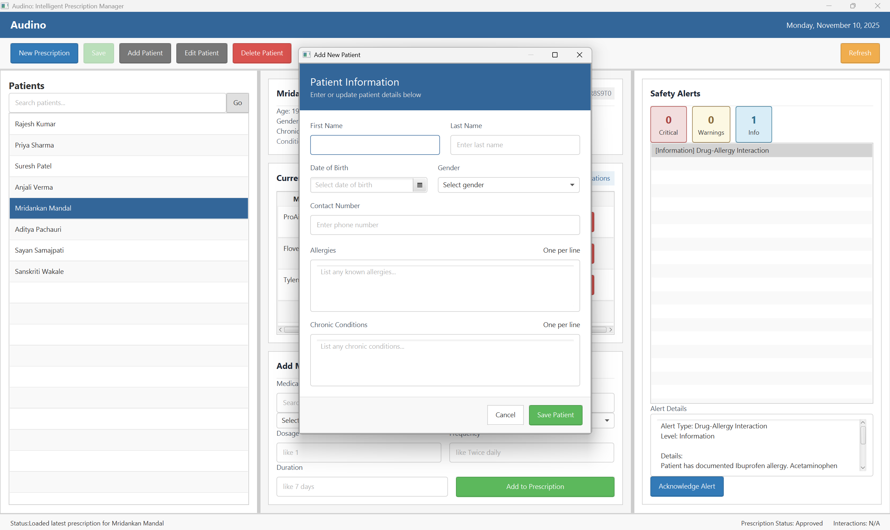
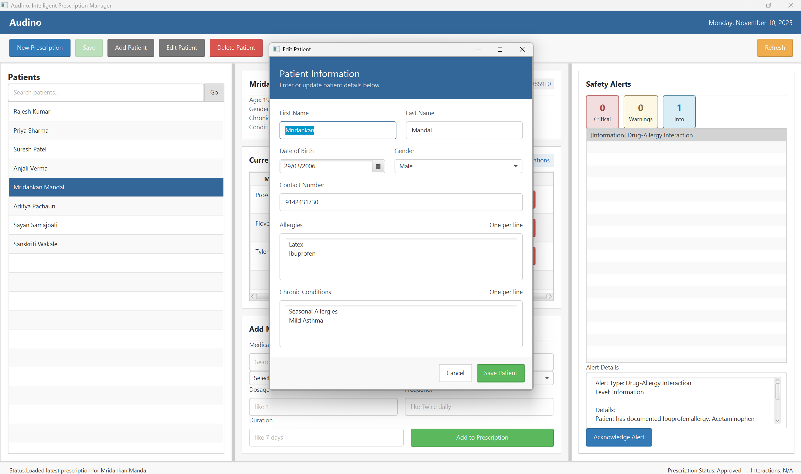

# Audino: Intelligent Prescription Manager

## Overview

Audino is a comprehensive Java-based desktop application designed to help healthcare professionals prevent adverse drug events by providing real-time drug interaction analysis during prescription creation. The application demonstrates advanced Object-Oriented Programming concepts, design patterns, and modern software engineering practices.

## Features

### Core Functionality
- **Patient Management System**: A simple, searchable interface for patient records.
- **Medication Database**: Comprehensive repository with external JSON data loading.
- **Prescription Builder**: Interactive prescription creation with real-time validation.
- **Intelligent Interaction Engine**: Rule-based system detecting three types of conflicts:
  - Drug-Allergy Interactions
  - Drug-Drug Interactions  
  - Drug-Condition Contraindications
- **Real-time Alerts**: Color-coded warnings with detailed explanations and recommendations.

### Technical Highlights
- **MVC Architecture**: Strict separation of concerns between data, logic, and UI.
- **Design Patterns**: Implements Strategy, Observer, Singleton, and Composition patterns.
- **Object-Oriented Design**: Leverages Inheritance, Polymorphism, and Encapsulation.
- **Asynchronous Processing**: Non-blocking interaction checking for a responsive UI.
- **Comprehensive Testing**: Includes a JUnit 5 test suite.

## Technology Stack

- **Language**: Java 17+
- **GUI**: JavaFX 19+
- **UI Layout**: FXML
- **Styling**: CSS
- **Build Tool**: Maven
- **Data Serialization**: Jackson
- **Testing**: JUnit 5

## Project Structure

```

audino/
└── src/
├── main/
│   ├── java/com/audino/
│   │   ├── model/
│   │   ├── controller/
│   │   ├── service/
│   │   └── util/
│   └── resources/
│       ├── data/
│       ├── fxml/
│       └── css/
└── test/
└── java/com/audino/

````

## Quick Start

### Prerequisites
- Java JDK 17 or higher
- Apache Maven 3.6 or higher

### Building the Application
From the project root directory:
```bash
mvn clean compile
````

### Running the Application

**Windows Users - Easy Launch:**
Double-click `Audino.bat` file to run the application.

**Or use command line:**
```bash
mvn javafx:run
```

**Or use PowerShell script:**
```powershell
.\start.ps1
```

### Running Tests

```bash
mvn test
```

### Building Executable Package

To create a distributable JAR with all dependencies:
```bash
mvn clean package -DskipTests
```

This creates `target/audino-1.1.0.jar` - however, JavaFX applications require special handling. Use the `Audino.bat` launcher for the best experience.

## Application Screenshots

### Main Window with Patient Data

**Description**: The main interface showing the patient list on the left, prescription creation form in the center, and interaction alerts panel displaying real-time drug safety warnings.

### Add Patient Dialog

**Description**: Dialog window for adding new patient information including name, date of birth, known allergies, and chronic medical conditions.

### Edit Patient Dialog

**Description**: Dialog window for editing existing patient information, allowing healthcare providers to update allergies, conditions, and personal details.

## Architecture Overview

### Design Patterns Implemented

#### 1\. Model-View-Controller (MVC)

  - **Model**: `Patient`, `Medication`, `Prescription` classes in the `com.audino.model` package.
  - **View**: `MainWindow.fxml` and `application.css` in the resources folder.
  - **Controller**: `MainController` in the `com.audino.controller` package.

#### 2\. Strategy Pattern

  - `InteractionCheckStrategy` interface defines the contract for checking different types of conflicts.
  - Concrete implementations (`AllergyCheckStrategy`, `DrugDrugCheckStrategy`, `ConditionCheckStrategy`) are managed by the `InteractionEngine`.

#### 3\. Singleton Pattern

  - `ConfigurationManager` ensures a single, globally accessible instance for managing application settings like file paths.

#### 4\. Observer Pattern

  - Implemented via JavaFX properties and listeners. The UI components in `MainController` listen for changes in the selection models of `ListView` and `TableView` to trigger updates and actions automatically.

### Object-Oriented Design

#### Inheritance & Polymorphism

The abstract `Medication` class is extended by concrete classes like `TabletMedication`, `LiquidMedication`, and `InjectionMedication`. Each subclass provides its own specific implementation for methods like `isValidDosage()`, demonstrating polymorphism.

#### Encapsulation

All model classes have private fields, with access controlled through public getters and setters. Collections are returned as defensive copies to prevent external modification of the internal state.

## Data Management

Data for patients, medications, and interaction rules are stored in human-readable JSON files located in `src/main/resources/data/`. This approach allows for easy updates to the application's knowledge base without needing to recompile the source code. The `DataService` class handles the loading and parsing of these files.

### Sample Data:

The application includes demonstration data featuring:
- **150 Medications**: Including common drugs like Lisinopril, Warfarin, and Ibuprofen, plus a comprehensive generic medication database.
- **8 Sample Patients**: Realistic patient profiles including Mridankan Mandal, Aditya Pachauri, Sayan Samajpati, and Sanskriti Wakale, each with unique medical histories, allergies, and chronic conditions.
- **Interaction Rules**: Pre-configured rules for drug-drug, drug-allergy, and drug-condition interactions.

