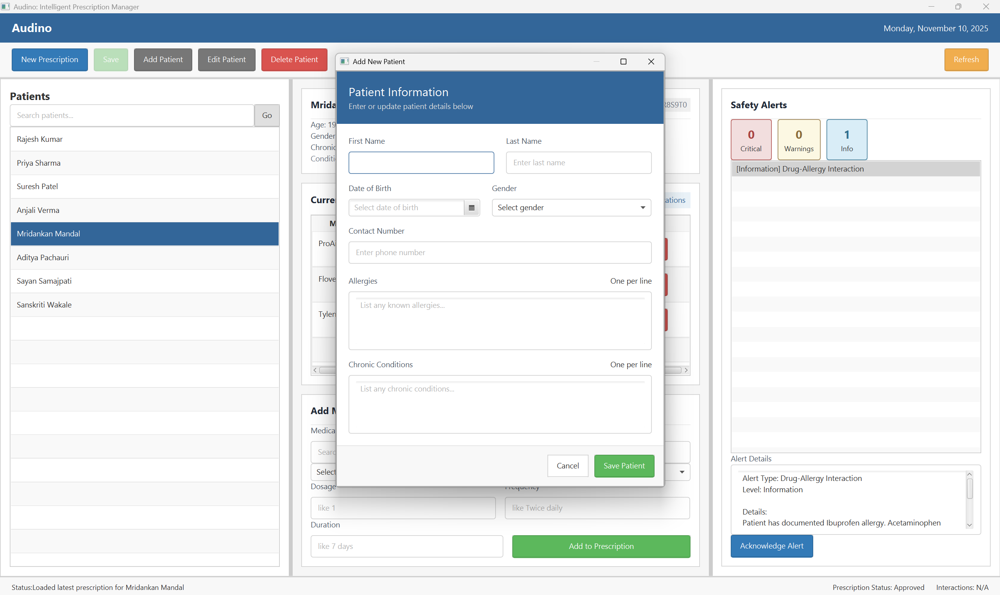
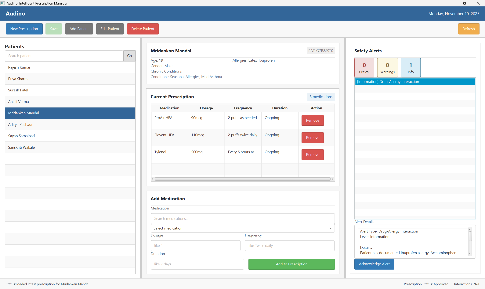
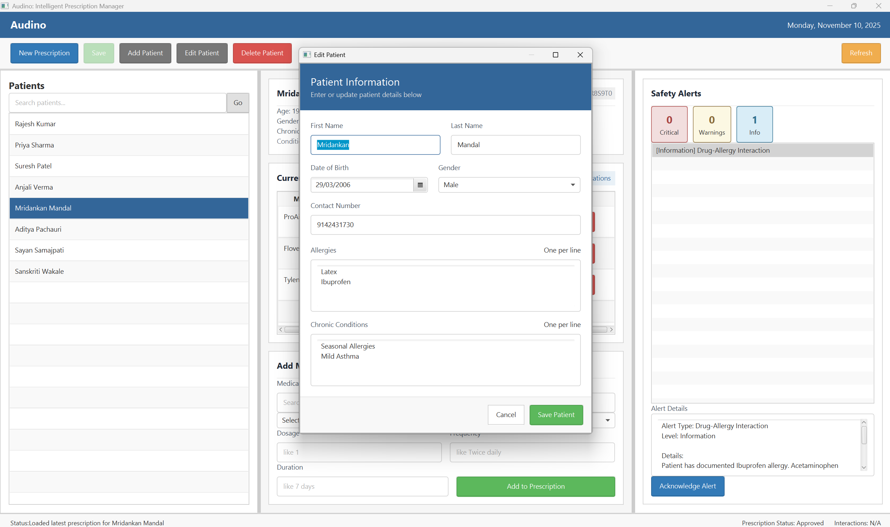

# Audino - Usage Guide:

## Getting Started:

### Database Storage:

Audino uses a persistent Embedded PostgreSQL database. All clinical data is securely stored natively within the project directory:
- **Path**: `data/pg-data/`

### Populating the Database with Test Data:

To instantly populate the database with a high-fidelity clinical dataset (100+ random Indian patients, 100+ real-world medications with INR pricing, 50+ interaction rules, and fully populated prescriptions), you can run the internal data seeder module.

Execute the following Maven command from the project root:
```powershell
mvn compile exec:java "-Dexec.mainClass=com.audino.util.AppSeeder"
```
*Note: Make sure the main Audino JavaFX application is closed before running the seeder to prevent database file lock conflicts.*

### Launching the Application:

After installation and optional database seeding, run the application using:
```powershell
.\start.ps1
```

The main window will open displaying the Audino interface.

## Main Features:

### 1. Patient Management:

#### Viewing Patient Information:
- Select a patient from the patient list.
- Patient details display including name, age, and medical history.
- View current allergies and medical conditions.

#### Sample Demonstration Patients:
The application includes baseline patients for demonstration:
- **Mridankan Mandal** (Born: April 12, 1998) - Mild asthma and pollen allergy profile.
- **Ravi Kumar** (Born: September 21, 1985) - Hypertension and chronic kidney disease profile with penicillin allergy.
- **Neha Patel** (Born: February 3, 1991) - General profile for non-alert and mixed-prescription scenarios.

#### Adding a New Patient:
- Click the "Add Patient" button.
- Fill in required fields: name, date of birth, allergies, conditions.
- Save the patient record.


**Description**: Add new patient window where you can enter patient name, birth date, allergies like Penicillin, and chronic conditions like Hypertension.

### 2. Medication Database:

#### Browsing Medications:
- Access the medication database from the main menu.
- Search medications by name or active ingredient.
- View detailed medication information including form type and standard dosages.

#### Medication Types:
- **Tablets**: Solid oral medications with dosage in milligrams.
- **Liquids**: Liquid oral medications with dosage in milliliters.
- **Injections**: Injectable medications with dosage in milliliters.

### 3. Prescription Creation:


**Description**: Main window showing patient list on left, medication prescription form in center with dosage and frequency fields, and drug interaction alerts displayed at the bottom.

#### Creating a New Prescription:
- Select the patient for whom the prescription is being created.
- Click "New Prescription" button.
- Add medications to the prescription.
- Specify dosage and frequency for each medication.

#### Adding Medications:
- Search for medication in the database.
- Select the medication from results.
- Enter prescribed dosage and administration instructions.
- Click "Add to Prescription".

### 4. Interaction Checking:

#### Automatic Checks:
The system automatically performs three types of checks:

1. **Drug-Drug Interactions**:
   - Detects potentially harmful combinations.
   - Shows severity level and description.

2. **Drug-Allergy Interactions**:
   - Checks medications against patient's known allergies.
   - Prevents allergic reactions.

3. **Drug-Condition Interactions**:
   - Verifies medication safety with patient's medical conditions.
   - Warns about contraindications.

#### Understanding Alerts:

**Alert Levels**:
- **CRITICAL**: Severe interaction, prescription should not be dispensed.
- **MAJOR**: Significant interaction requiring physician review.
- **MODERATE**: Monitor patient closely for adverse effects.
- **MINOR**: Low-risk interaction, patient awareness sufficient.

**Alert Types**:
- **DRUG_DRUG**: Interaction between two medications.
- **DRUG_ALLERGY**: Medication conflicts with patient allergy.
- **DRUG_CONDITION**: Medication contraindicated for patient condition.

#### Responding to Alerts:
- Review alert details carefully.
- Consult interaction description for clinical guidance.
- Remove problematic medication if necessary.
- Seek alternative medications when critical alerts appear.
- Document decision if proceeding despite warnings.

### 5. Prescription Management:

#### Prescription Status:
- **DRAFT**: Prescription being created, not finalized.
- **ACTIVE**: Approved and currently in use.
- **COMPLETED**: Prescription course finished.
- **CANCELLED**: Prescription cancelled before completion.

#### Editing Prescriptions:
- Select prescription from patient's history.
- Modify medications or dosages as needed.
- Re-check for interactions after changes.


**Description**: Edit patient dialog allowing you to update existing patient information including allergies, chronic conditions, and contact details.

#### Prescription History:
- View all past prescriptions for a patient.
- Access historical interaction alerts.
- Track medication changes over time.

## Best Practices:

### For Safe Prescribing:
- Always review patient allergies before prescribing.
- Check patient's current medical conditions.
- Never ignore CRITICAL level alerts.
- Document reasons for overriding alerts.
- Update patient information regularly.

### For Optimal System Use:
- Keep medication database current.
- Regularly update interaction rules.
- Back up patient data frequently.
- Train staff on alert interpretation.
- Review system reports periodically.

## Keyboard Shortcuts:

- `Ctrl+N`: New prescription.
- `Ctrl+P`: Select patient.
- `Ctrl+M`: Open medication database.
- `Ctrl+S`: Save current prescription.
- `Ctrl+Q`: Quit application.
- `F1`: Help documentation.

## Troubleshooting:

### Common Issues:

#### Application Won't Start:
- Verify Java is installed correctly.
- Check Maven dependencies are downloaded.
- Review console output for error messages.

#### Data Not Loading:
- Ensure the configured PostgreSQL directory is writable.
- Verify `postgresql.database.path` in `application.properties`.
- Check filesystem permissions for the database file path.

#### Interaction Checks Not Working:
- Verify interaction rules exist in the `interaction_rules` table.
- Check medication identifiers and patient allergy/condition values.
- Review console for service errors.

## Getting Help:

- Consult `README.md` for quick reference.
- Review `CodeBaseIndex.md` for system architecture.
- Check `InstallationAndSetup.md` for configuration issues.
- Contact system administrator for technical support.
